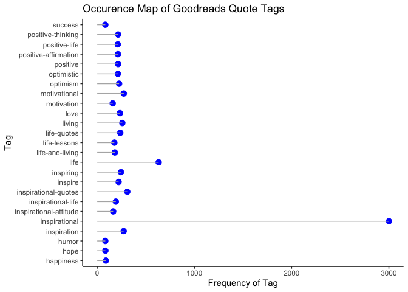
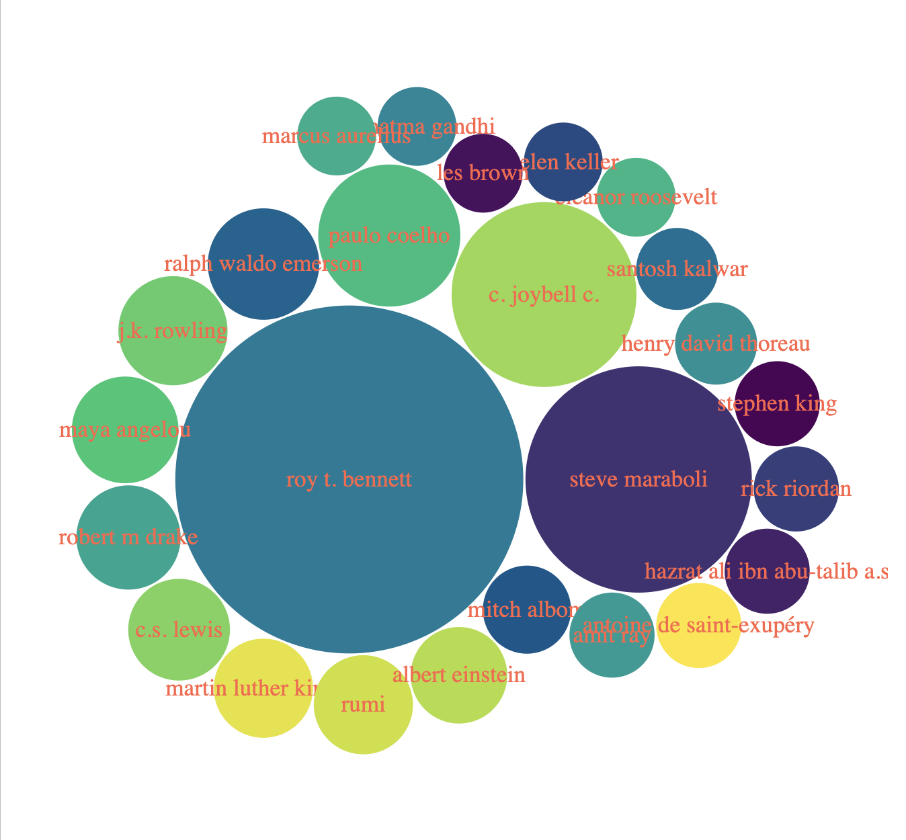
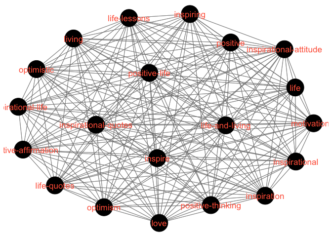
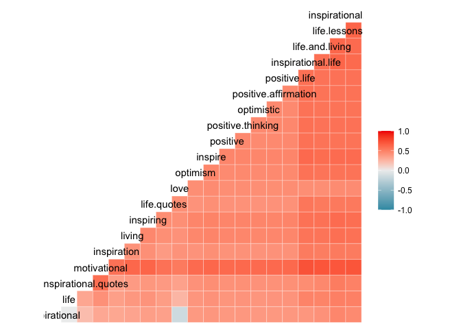

Goodreads Quotes Analysis
================
Jordan M.
2023-03-12

This data was sourced from Kaggle, see
[here](https://www.kaggle.com/datasets/abhishekvermasg1/goodreads-quotes).

We, as soulful beings, are quite fond of words of meaning and power,
whether they be words of passion or inspiration. I thought it would be
interesting to delve a bit into the trends found in the published quotes
found on Goodreads, one of the most popular aggregators of this type of
online content. This is just to serve as an object of curiosity as well
as an opportunity for practice on my data science journey.

My thinking is to identify the more valuable metrics of relation with
such data and to gain insight about popular quotes on the platform,
including common themes and authors, as well as the relationship between
likes and other variables. What is important to note here is that
Goodreads organizes their quotes database by author and tag.

## Loading the Data

The following packages were used and experimented with:

``` r
library(dplyr)
library(ggplot2)
library(readr)
library(tidyr)
library(pander)

library(tidygraph)
library(tidyverse)
library(tibble)
library(igraph)
library(GGally)
library(corrgram)
library(bubbles)
library(stringr)
```

Kaggle typically presents clean and “pristine” datasets, corroborated by
the fact that it is a platform that provides a system of voting for
posts, with it intuitively following that “better” datasets receive more
votes and thus are more visible. That being said, it was still verified
that the dataset doesn’t contain any duplicates.

``` r
quotes <- read_csv("quotes.csv")
head(quotes)
```

    ## # A tibble: 6 × 5
    ##   index quote                                                author tags   likes
    ##   <dbl> <chr>                                                <chr>  <chr>  <dbl>
    ## 1     0 Be yourself; everyone else is already taken.         Oscar… attr… 149270
    ## 2     1 You've gotta dance like there's nobody watching      Willi… danc… 118888
    ## 3     2 Be the change that you wish to see in the world.     Mahat… acti… 106749
    ## 4     3 No one can make you feel inferior without your cons… Elean… conf…  85854
    ## 5     4 Live as if you were to die tomorrow. Learn as if yo… Mahat… carp…  73033
    ## 6     5 Darkness cannot drive out darkness: only light can … Marti… dark…  72616

A brief look at the format of the dataset can be seen above. It includes
an index based on the reverse numerical sorting of the number of likes,
the quote itself, the author, the tags assigned to the quote in the
organization on the platform, and the number of likes themselves.

## Summary Statistics

Basic summary statistics can be found below:

``` r
pander(summary(quotes))
```

|     index     |      quote       |      author      |       tags       |
|:-------------:|:----------------:|:----------------:|:----------------:|
|   Min. : 0    |   Length:3001    |   Length:3001    |   Length:3001    |
| 1st Qu.: 750  | Class :character | Class :character | Class :character |
| Median : 1500 | Mode :character  | Mode :character  | Mode :character  |
|  Mean : 1561  |        NA        |        NA        |        NA        |
| 3rd Qu.: 2250 |        NA        |        NA        |        NA        |
| Max. :186392  |        NA        |        NA        |        NA        |

Table continues below

|    likes     |
|:------------:|
|  Min. : 23   |
| 1st Qu.: 147 |
| Median : 282 |
| Mean : 1316  |
| 3rd Qu.: 722 |
| Max. :149270 |

However, the base R function doesn’t tell us much in this case. What
would be more useful would be to know frequency counts for factors such
as tags and authors.

# Tags

Looking first at the summary stats for tags, I parse the data and
separate the each record into their individual tag for ease of use.

``` r
quotes_tags <- separate_rows(quotes,4,sep = ';')
tags <- unlist(strsplit(quotes$tags, ";"))
tags_freq <- table(tags)
```

Here, it is important to note that while no tag is necessarily
duplicated, many are similar to each other. For instance, there is
“inspirational” along with other such as “inspiration”,
“inspirational-life”, “inspirational-attitude”, “inspirational-quotes”,
and so on. I could of course drop these but I think it could be argued
that these speak to the overall trend in the kind of quotes being
searched for and read, given their prevalence.

``` r
tags_freq_df <- quotes %>%
  separate_rows(tags, sep = ";") %>%
  group_by(tags) %>%
  summarise(freq = n()) %>%
  ungroup()

ggplot(tags_freq_df[order(tags_freq_df$freq, decreasing = TRUE), ][1:25,], aes(x = freq, y = tags)) +
  geom_point(size = 3, color = "blue") +
  geom_segment(aes(x = 0, y = tags, xend = freq, yend = tags),
               color = "gray70", size = 0.5) +
  theme_classic() +
  labs(title = "Occurence Map of Goodreads Quote Tags",
       x = "Frequency of Tag", y = "Tag")
```

<!-- -->

We see that “inspirational” is far and away the most popular and
frequent tag.

# Authors

Now looking at the summary stats for the authors of the quotes, the data
is once again parsed for utility and convenience. I normalized the
author names so as to avoid duplicates to be had from extra punctuation
marks or whitespace.

``` r
normalize_author <- function(author) {
  # Remove any extra commas and spaces
  author <- gsub(",\\s*", "", author)
  # Convert to lowercase
  author <- tolower(author)
  # Return the normalized author name
  return(author)
}

authors <- sapply(quotes$author, normalize_author)
quotes_authors <- quotes
quotes_authors$author <- authors
author_freq <- table(authors)
```

## Bubble Graph

A very popular way of visualizing the frequency of occurrence is via a
bubble graph. First, I plotted it for the tags:

``` r
top_tags <- names(sort(tags_freq, decreasing = TRUE)[1:15])
top_freq <- as.numeric(tags_freq[top_tags])

bubbles(top_freq, 
        label = top_tags,
        textColor = "tomato",color = hcl.colors(15,palette = "viridis", alpha=NULL)[sample(15)]
          )
```


And then for the authors:

``` r
top_authors <- names(sort(author_freq, decreasing = TRUE)[1:25])
top_author_freq <- as.numeric(author_freq[top_authors])

bubbles(top_author_freq, 
        label = top_authors,
        textColor = "tomato",color = hcl.colors(25,palette = "viridis", alpha=NULL)[sample(25)]
)
```



## Network Graph of Tag Occurrences

Along with looking at the frequency of tag appearances, we can also look
at the frequency of co-occurrences of the tags. We map this to a matrix
by the following:

``` r
tag_pair <- crossprod(table(quotes_tags[3:4]))
diag(tag_pair) <- 0
```

From there, in the interest of both visibility and computational
frugality, I limited the tags mapped to the 20 most co-occurring pairs.
The following map is produced:

``` r
top_100_tags <- names(sort(tags_freq, decreasing = TRUE)[1:20])

sub_matrix <- tag_pair[top_100_tags, top_100_tags]

ggnet2(sub_matrix, size = 12, label = TRUE, color = "black", label.color = "tomato")
```

<!-- -->

This is a relatively newly popular way of mapping the relationship
between actors in different circumstances.

## Miscellaneous Visualizations

Other methods of mapping correlations include:

### Correlelograms

``` r
ggcorr(sub_matrix, method = c("everything", "pearson"))
```

<!-- -->

### Heatmaps

``` r
heatmap(sub_matrix, Colv = NA, Rowv = NA, scale="column",col = rainbow(256))
```

<!-- -->
