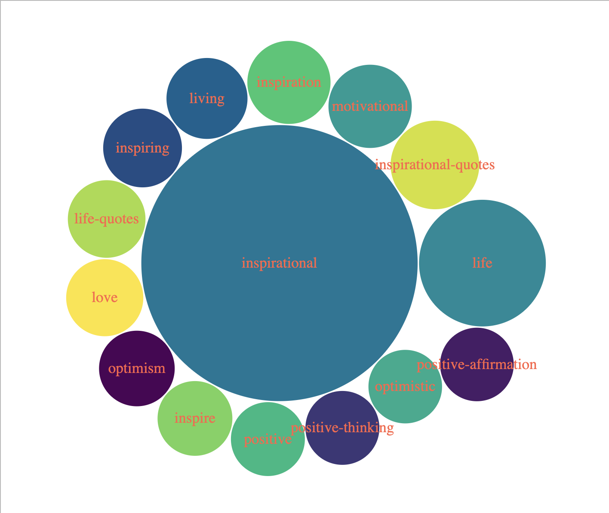
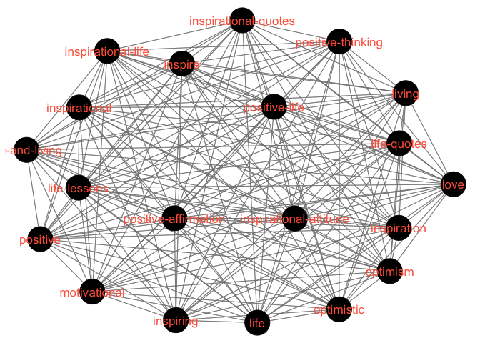
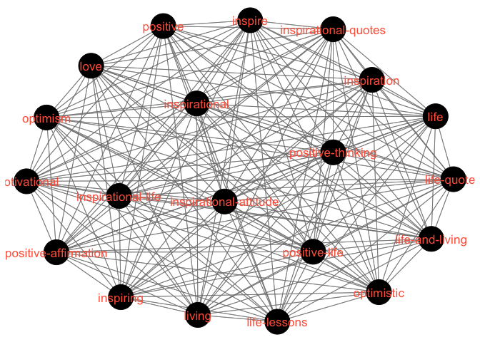
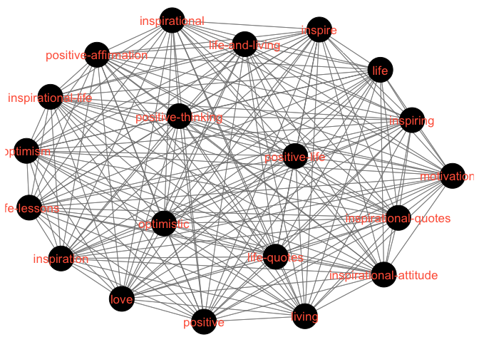

Goodreads Quotes Analysis
================
Jordan M.
2023-03-12

This data was sourced from Kaggle see
<https://www.kaggle.com/datasets/abhishekvermasg1/goodreads-quotes>. We,
as soulful beings, are quite fond of words of meaning and power, whether
they be words of passion or inspiration. I thought it would be
interesting to delve a bit into the trends found in the published quotes
found on Goodreads, one of the most popular aggregators of this type of
online content. This is just to serve as an object of curiousity as well
as an opportunity for practice on my data science journey.

## Loading the Data

The following packages were used and experimented with:

``` r
library(dplyr)
library(ggplot2)
library(readr)
library(tidyr)

library(tidygraph)
library(tidyverse)
library(tibble)
library(igraph)
library(GGally)
library(corrgram)
library(bubbles)
```

``` r
quotes <- read_csv("quotes.csv")
quotes_clean <- separate_rows(quotes,4,sep = ';')

tags <- unlist(strsplit(quotes$tags, ";"))
tags_freq <- table(tags)
```

## Analysis of Frequency

The most obvious observation that we can make is looking at the most
frequently appearing tag for the individual quote.

``` r
tags_freq_df <- quotes %>%
  separate_rows(tags, sep = ";") %>%
  group_by(tags) %>%
  summarise(freq = n()) %>%
  ungroup()

ggplot(tags_freq_df[order(tags_freq_df$freq, decreasing = TRUE), ][1:25,], aes(x = freq, y = tags)) +
  geom_point(size = 3, color = "blue") +
  geom_segment(aes(x = 0, y = tags, xend = freq, yend = tags),
               color = "gray70", size = 0.5) +
  theme_classic() +
  labs(title = "Occurence Map of Goodreads Quote Tags",
       x = "Frequency of Tag", y = "Tag")
```

<!-- -->

We see that “inspirational” is far and away the most popular and
frequent tag.

## Bubble Graph

Another way to map this is using a bubble graph:

``` r
top_tags <- names(sort(tags_freq, decreasing = TRUE)[1:15])
top_freq <- as.numeric(tags_freq[top_tags])

bubbles(top_freq, 
        label = top_tags,
        textColor = "tomato",color = hcl.colors(15,palette = "viridis", alpha=NULL)[sample(15)]
          )
```



## Network Graph

Along with looking at the frequency of tag appearances, we can also look
at the frequency of co-occurrences of the tags. We map this to a matrix
by the following:

``` r
tag_pair <- crossprod(table(quotes_clean[3:4]))
diag(tag_pair) <- 0
```

From there, in the interest of both visibility and computational
frugality, I limited the tags mapped to the 20 most co-occurring pairs.
The following map is produced:

``` r
top_100_tags <- names(sort(tags_freq, decreasing = TRUE)[1:20])

sub_matrix <- tag_pair[top_100_tags, top_100_tags]

ggnet2(sub_matrix, size = 12, label = TRUE, color = "black", label.color = "tomato")
```

<!-- -->

## Miscellaneous Visualizations

Other methods of mapping correlations include:

### Correlelograms

``` r
ggcorr(sub_matrix, method = c("everything", "pearson"))
```

<!-- -->

### Heatmaps

``` r
heatmap(sub_matrix, Colv = NA, Rowv = NA, scale="column",col = rainbow(256))
```

<!-- -->
